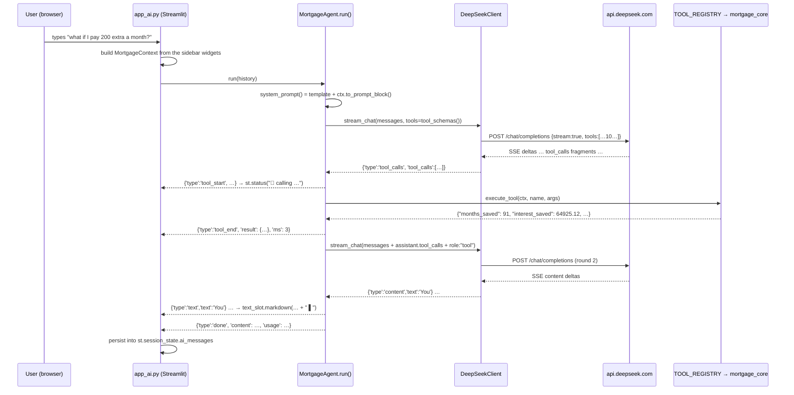

# The AI Assistant — How It Actually Works

A study guide to the DeepSeek-powered chat assistant bolted onto the Mortgage Analyzer.
It assumes you know Python but have never written an LLM tool-calling loop.

Files this document describes:

| File | Lines | Role |
|---|---|---|
| `mortgage_core.py` | 320 | Pure math. No Streamlit, no network. |
| `mortgage_agent.py` | 1573 | DeepSeek HTTP client, the 10 tools, the tool-calling loop. |
| `app_ai.py` | 1303 | The Streamlit UI: original 4 tabs + `🤖 Ask AI` tab + sidebar controls. |
| `app.py` | 868 | The original app. **Untouched.** Still runs standalone. |

---

## Table of contents

1. [Quickstart](#1-quickstart)
2. [Architecture](#2-architecture)
3. [How tool-calling actually works](#3-how-tool-calling-actually-works)
4. [The tool catalogue](#4-the-tool-catalogue)
5. [Streaming and SSE](#5-streaming-and-sse)
6. [The event protocol](#6-the-event-protocol)
7. [Streamlit mechanics worth understanding](#7-streamlit-mechanics-worth-understanding)
8. [Configuration reference](#8-configuration-reference)
9. [Error handling and troubleshooting](#9-error-handling-and-troubleshooting)
10. [Security notes](#10-security-notes)
11. [Extending it](#11-extending-it)
12. [Known quirks and divergences](#12-known-quirks-and-divergences)

---

## 1. Quickstart

### 1.1 Get an API key

Sign up at **[platform.deepseek.com](https://platform.deepseek.com)** and create an API key.
It looks like `sk-…`. You need a non-zero balance — DeepSeek returns HTTP `402` when the
account is empty, and the app will tell you so in plain English.

### 1.2 Install

```bash
cd mortgage-analyzer
pip install -r requirements.txt
```

`requirements.txt` is:

```
streamlit>=1.46.1
pandas==2.2.0
plotly==5.18.0
streamlit-aggrid==0.3.4
requests>=2.31.0
```

Note the **only** new dependency is `requests`. The `openai` SDK is deliberately *not* used —
`mortgage_agent.py` speaks the OpenAI-compatible wire protocol by hand, which is precisely
what makes it worth studying.

The Streamlit floor is load-bearing: `app_ai.py` puts `st.chat_input` inside `with tab5:`,
and that inline placement raises `StreamlitAPIException` on older releases. The file used to
pin `1.32.0`, inherited from the original project, which meant a fresh virtualenv built from
it could never render the AI tab. 1.46.1 is the version everything here was verified against.
The other three pins are unchanged — none of them conflicts with the bump (`streamlit-aggrid`
0.3.4 only asks for `streamlit>=0.87.0`, and Streamlit 1.46.1 accepts `pandas<3,>=1.4.0`).
`streamlit-aggrid` is still required even though neither `app.py` nor `app_ai.py` renders an
`AgGrid` yet: both import it at module scope, so removing it breaks the import.

### 1.3 Supply the key — three ways, first hit wins

The resolution order is implemented in `resolve_api_key()` in `app_ai.py`:

```python
def resolve_api_key(typed_key):
    if typed_key and typed_key.strip():
        return typed_key.strip(), "the box above"
    try:
        secret_key = st.secrets["DEEPSEEK_API_KEY"]
    except Exception:              # missing secrets.toml raises on some versions
        secret_key = None
    if secret_key and str(secret_key).strip():
        return str(secret_key).strip(), "st.secrets"
    env_key = os.environ.get("DEEPSEEK_API_KEY")
    if env_key and env_key.strip():
        return env_key.strip(), "the DEEPSEEK_API_KEY environment variable"
    return None, None
```

**Option A — sidebar box.** Expand `🤖 AI Assistant` in the sidebar, paste the key into the
password field. Lives in `st.session_state` for the browser session only. Nothing is written
to disk.

**Option B — `secrets.toml`.** Create `.streamlit/secrets.toml` next to `app_ai.py`:

```toml
# .streamlit/secrets.toml
DEEPSEEK_API_KEY = "sk-your-real-key-here"
```

```bash
mkdir -p .streamlit
printf 'DEEPSEEK_API_KEY = "sk-…"\n' > .streamlit/secrets.toml
```

The `try/except Exception` around `st.secrets[...]` matters: on several Streamlit versions,
*reading* `st.secrets` when no `secrets.toml` exists raises rather than returning `None`.
Without the guard the whole app would crash for every user who never created the file.

**Option C — environment variable.**

```bash
export DEEPSEEK_API_KEY="sk-your-real-key-here"
streamlit run app_ai.py
```

Whichever wins, the sidebar shows a masked confirmation produced by `mask_api_key()` —
`sk-…4f2a` — plus the source label, e.g. `🔑 Using sk-…4f2a from st.secrets.`
The full key is never rendered, never logged, never persisted.

### 1.4 Run

```bash
streamlit run app_ai.py     # calculator + AI assistant  (5 tabs)
streamlit run app.py        # the original, unchanged     (4 tabs)
```

`app.py` is never imported by `app_ai.py` and was never edited. Both are independently
runnable; `app_ai.py` is a standalone copy of the UI whose five math functions come from
`mortgage_core` instead of being defined inline.

### 1.5 First conversation

Open the `🤖 Ask AI` tab. With no key, you get a friendly three-step setup card instead of a
stack trace. With a key, hit **🔌 Test connection** in the sidebar first (one-token probe,
costs almost nothing), then click a starter button such as *"What if I pay 200 extra a month?"*.

Open the `🔧 called …` panels under the answer. Every number the assistant states can be
traced to the JSON a Python function returned. That auditability is the whole design.

---

## 2. Architecture

### 2.1 Three modules, one rule each

```
mortgage_core.py     pure math          imports: pandas, numpy, datetime
        ▲                               forbidden: streamlit, requests, any I/O
        │
        ├──────────────────────────────┐
        │                              │
mortgage_agent.py    LLM + tools    app_ai.py     UI
imports: requests,                  imports: streamlit, plotly, st_aggrid,
         mortgage_core                       mortgage_core, mortgage_agent
forbidden: streamlit                 owns: widgets, session_state, rendering
```

**Why split it this way?**

*The math has no Streamlit dependency.* `mortgage_core.py` can be imported from a plain
`python3` REPL, a pytest suite, or a batch script. You just saw that in action — every number
in this document was produced by importing `mortgage_core` directly. If the math lived inside
`app.py` (as it originally did), the only way to exercise it would be to boot a web server.

*The agent has no Streamlit dependency either.* `mortgage_agent.py` imports `requests` and
`mortgage_core`, nothing else. You can drive the whole tool-calling loop from a script with
no browser involved — useful for debugging prompts without fighting the rerun model.

*One source of truth.* This is the important one. `app_ai.py`'s charts and the agent's tools
both ultimately derive from `mortgage_core`. The UI calls `generate_amortization_schedule()`;
the tools call `amortization_records()`. Both apply the same rate convention
(`annual_rate / 12 / 100`), the same `calculate_monthly_payment()` closed form, the same
`max(0, …)` balance clamp. The chat therefore cannot invent a monthly payment that
contradicts the metric card two tabs over.

> **Honest caveat, because you are studying this rather than selling it:** agreement is not
> automatic — it is a property that had to be engineered and is held in place by tests.
> An earlier build of this code *did* disagree once early payments were configured: the UI
> schedule dropped the final payoff row (a bug inherited from `app.py`) while the agent's
> records kept it, so tab 4 said 344 payments and the chat said 345. That is fixed — the two
> now agree by construction for every configuration, and `TestD2Consistency` in
> `test_ai_assistant.py` fails loudly if they ever drift apart again. See §12.1.
>
> The one residual difference is cosmetic and worth understanding: tabs 1 and 4 total a
> currency column by parsing its `"$1,234.56"` display strings back to floats, so summing a
> few hundred already-rounded values drifts a few cents from the exact float total
> (\$208,218.10 vs \$208,218.14). That is display rounding, not a second source of truth.

### 2.2 Request flow



The same flow in ASCII, if you prefer:

```
sidebar widgets ─┐
                 ├─> MortgageContext(property_value, down_payment, loan_amount,
session_state    │                   interest_rate, loan_term, early_payments, currency)
 .early_payments─┘            │
                              ├─> .to_prompt_block()  ──> system prompt
                              └─> .records()          ──> every tool's numbers
                                        ▲
   st.chat_input ──> MortgageAgent.run(history) ──> loop:
                              │                        POST → SSE → tool_calls?
                              │                          yes → execute_tool ──┘
                              │                          no  → done
                              └─> yields events ──> app_ai.py renders them
```

---

## 3. How tool-calling actually works

This is the section to read twice.

### 3.1 The problem tool-calling solves

An LLM is a next-token predictor. Ask it *"if I add \$200/month to a \$240,000 loan at 5% over
30 years, how much interest do I save?"* and it will produce an answer that **looks** exactly
like the right answer: confident, correctly formatted, with a plausible magnitude — and wrong
by hundreds or thousands. It has not solved the payoff equation that
`calculate_extra_payment_impact()` implements:

```
n = log(total_payment / (total_payment - principal * monthly_rate)) / log(1 + monthly_rate)
```

It has pattern-matched against every mortgage article in its training data. Sometimes the
result is close. You cannot tell which times.

Tool-calling inverts the responsibility:

> **The model chooses *which* computation to run and with *what* arguments.
> Python runs it. The model then reads the answer back and explains it.**

The model does language. Python does arithmetic. Neither does the other's job. That single
sentence is the design of `mortgage_agent.py`, and the system prompt states it as a rule:

```
- For ANY figure that is not literally in the state block, you MUST call a tool. Never estimate,
never do the arithmetic yourself, never reuse a number from earlier in the conversation if the
parameters may have changed. The tools are the only source of truth.
```

### 3.2 The conversation is an array, and it grows

The key mental model: a chat completion API is **stateless**. The server remembers nothing.
Every request re-sends the entire conversation. A "tool call" is not a callback or a
websocket — it is the model emitting a specially-shaped assistant message, your code noticing
it, and your code appending two more messages to the array before asking again.

That is why the loop exists, and why the model is invoked more than once per user question.

### 3.3 Walkthrough: "What if I pay 200 extra a month?"

Live context for this trace (the app's defaults): property \$300,000, down payment \$60,000,
loan \$240,000, 5.00%, 30 years, no early payments configured.

---

#### Step 0 — Build the request

`MortgageAgent.run()` opens with:

```python
messages: list[dict] = [{"role": "system", "content": self.system_prompt()}]
messages.extend(self._clean_history(history))
```

`_clean_history()` is a whitelist filter: it keeps only dicts whose `role` is `"user"` or
`"assistant"` and whose `content` is a non-empty string. Tool noise from previous exchanges
never re-enters the array — each `run()` starts a fresh tool loop.

**`messages[0]` — the system message.** `system_prompt()` formats
`SYSTEM_PROMPT_TEMPLATE` with `ctx.to_prompt_block()` and `ctx.currency`. The state block is
generated live from `MortgageContext.headline()`:

```text
You are the mortgage analyst built into this mortgage calculator app. You are attached to ONE
specific, live calculation — the one the user currently has on screen, described in the state
block below. …

CURRENT MORTGAGE STATE (live values from the calculator):
- Currency: $
- Property value: $300,000.00
- Down payment: $60,000.00 (LTV 80.0%)
- Loan amount: $240,000.00
- Annual interest rate: 5.00%
- Term: 30 years (360 monthly payments)
- Monthly payment: $1,288.37
- Total paid over the loan: $463,813.88
- Total interest: $223,813.88 (93.3% of the loan amount)
- First payment: 2026-08-01, final payment: 2056-07-01 (payment #360)
- Early/extra payments currently configured: none

HOW TO WORK
- The state block above is live. Answer trivial questions about it directly, without a tool call.
- For ANY figure that is not literally in the state block, you MUST call a tool. …
```

The state block is a deliberate optimisation: *"how much do I pay per month?"* is answered
from the prompt with zero tool calls and zero extra round trips. Only figures **not** in the
block force a tool call.

**`messages[1]` — the user turn:**

```json
{"role": "user", "content": "What if I pay 200 extra a month?"}
```

**The `tools` array.** `tool_schemas()` returns `[spec.schema for spec in TOOL_REGISTRY.values()]`
— all ten, on every request except the forced-final round. One entry, verbatim:

```json
{
  "type": "function",
  "function": {
    "name": "simulate_extra_monthly_payment",
    "description": "Simulate paying a fixed extra amount on top of EVERY monthly payment. Returns the new payoff month and date, months and years saved, and the interest saved versus the current setup. Use for 'what if I pay X more each month?'.",
    "parameters": {
      "type": "object",
      "properties": {
        "extra_monthly": {
          "type": "number",
          "description": "Extra amount added to every monthly payment, in the loan currency. Must be greater than 0.",
          "exclusiveMinimum": 0
        }
      },
      "required": ["extra_monthly"]
    }
  }
}
```

Those `description` strings are not documentation for humans. They are **the only thing the
model sees** when deciding which tool fits the question. Writing them is prompt engineering:
note the embedded example phrasings (`"what if I pay X more each month?"`) and the routing
hint on `get_schedule_window` ("prefer get_yearly_summary for long spans"). A vague
description produces a model that picks the wrong tool.

The full POST body, assembled by `DeepSeekClient._payload()`:

```json
{
  "model": "deepseek-v4-pro",
  "messages": [ {"role":"system", "..."}, {"role":"user", "..."} ],
  "stream": true,
  "temperature": 0.2,
  "thinking": {"type": "disabled"},
  "tools": [ /* 10 schemas */ ],
  "tool_choice": "auto"
}
```

`tool_choice: "auto"` = *you may call a tool or answer directly, your call*. It is only set
when `tools` is non-empty.

---

#### Step 1 — The model replies with a tool call, not an answer

The stream carries no `content`. Instead the deltas carry `tool_calls`, which
`DeepSeekClient` assembles (see §5) and emits as one event. `MortgageAgent.run()` catches it:

```python
elif kind == "tool_calls":
    tool_calls = event["tool_calls"]
```

Assembled shape:

```json
[
  {
    "id": "call_0_9f3c1a7e",
    "type": "function",
    "function": {
      "name": "simulate_extra_monthly_payment",
      "arguments": "{\"extra_monthly\": 200}"
    }
  }
]
```

Two things to notice, because both trip people up:

1. **`arguments` is a JSON *string*, not an object.** It has to be parsed. It is also
   model-generated text, so it can be malformed — handled below.
2. **`id` matters.** It is the correlation key. The result you send back must quote it
   exactly, or the model cannot tell which result answers which call.

`run()` appends the assistant's own turn to the array *verbatim* — including the tool calls:

```python
messages.append({
    "role": "assistant",
    "content": content,                       # usually "" on a tool-call round
    "tool_calls": [
        {"id": tc["id"], "type": "function", "function": tc["function"]}
        for tc in tool_calls
    ],
})
```

This step is mandatory and easy to forget. If you skip it and jump straight to the tool
result, the API rejects the request: a `role:"tool"` message with no preceding assistant
`tool_calls` is a protocol violation.

---

#### Step 2 — Python does the arithmetic

```python
args: dict = {}
parse_error: Optional[str] = None
if raw_args.strip():
    try:
        parsed = json.loads(raw_args)
    except (json.JSONDecodeError, ValueError):
        parse_error = (
            f"Could not parse the arguments for '{name}' as JSON. "
            f"Received: {raw_args[:200]}. Send a valid JSON object."
        )
    else:
        if isinstance(parsed, dict):
            args = parsed
        else:
            parse_error = f"Arguments for '{name}' must be a JSON object, got {type(parsed).__name__}."

yield {"type": "tool_start", "name": name, "args": args}
started = time.time()
result = {"error": parse_error} if parse_error else execute_tool(self.ctx, name, args)
elapsed_ms = int((time.time() - started) * 1000)
yield {"type": "tool_end", "name": name, "result": result, "ms": elapsed_ms}
```

A malformed-JSON argument string is **not** an exception. It becomes `{"error": "…"}` and
goes back to the model as a normal tool result. The model reads its own mistake and retries
with valid JSON on the next round. Same for unknown tool names, unexpected keyword
arguments, out-of-range payment numbers — `execute_tool()` funnels every failure mode into
the same shape:

```python
try:
    return spec.handler(ctx, **args)
except ToolInputError as exc:
    return {"error": str(exc)}
except TypeError as exc:
    detail = str(exc).replace(spec.handler.__name__, name)   # hide the private handler name
    return {"error": f"Bad arguments for '{name}': {detail}. Required: …"}
except Exception as exc:                                      # never crash the chat
    return {"error": f"'{name}' failed: {type(exc).__name__}: {exc}"}
```

This is a self-correcting loop. Errors are *information for the model*, not crashes.

The handler itself does the actual work — no LLM involved:

```python
def _tool_simulate_extra_monthly_payment(ctx, extra_monthly):
    extra = _as_float(extra_monthly, "extra_monthly")
    if extra <= 0:
        raise ToolInputError("'extra_monthly' must be greater than 0.")
    months = int(ctx.loan_term) * 12
    extras = list(ctx.early_payments or []) + [
        {"payment_number": n, "amount": extra} for n in range(1, months + 1)
    ]
    new_records = ctx.records(early_payments=extras)      # ← mortgage_core, deterministic
    out = _compare_scenarios(ctx, new_records, f"extra {ctx.currency}{extra:,.2f} every month")
    ...
```

It builds a synthetic list of 360 "early payments" of \$200 each, re-runs
`amortization_records()`, and diffs the two schedules payment by payment. Real number
crunching, in Python, on the user's own inputs.

---

#### Step 3 — Feed the result back, keyed by `tool_call_id`

```python
try:
    payload = json.dumps(result, default=str)
except (TypeError, ValueError):
    payload = json.dumps({"error": "Tool result could not be serialised."})

messages.append({
    "role": "tool",
    "tool_call_id": call.get("id") or "",
    "content": payload,
})
```

The message the model actually receives (real output, defaults above):

```json
{
  "role": "tool",
  "tool_call_id": "call_0_9f3c1a7e",
  "content": "{\"scenario\": \"extra $200.00 every month\", \"currency\": \"$\", \"current_payoff_months\": 360, \"new_payoff_months\": 269, \"months_saved\": 91, \"years_saved\": 7.58, \"current_payoff_date\": \"2056-07-01\", \"new_payoff_date\": \"2048-12-01\", \"current_total_interest\": 223813.88, \"new_total_interest\": 158888.76, \"interest_saved\": 64925.12, \"current_total_paid\": 463813.88, \"new_total_paid\": 398888.76, \"extra_paid_in_scenario\": 53600.0, \"extra_monthly\": 200.0, \"current_monthly_payment\": 1288.37, \"new_monthly_outlay\": 1488.37, \"note\": \"The extra amount is added to every scheduled payment on top of any early payments already configured in the calculator.\"}"
}
```

`content` is always a **string** — JSON serialised, not a nested object. `default=str` is the
safety net for anything `json` cannot encode (a stray `Decimal`, `date`, `numpy.float64`);
it stringifies rather than raising.

Because `rounds` has not yet hit `max_tool_rounds`, the `while True` loop goes around again.

---

#### Step 4 — Round 2, with the full array

The second POST carries **four** messages:

```json
[
  {"role": "system",    "content": "You are the mortgage analyst … CURRENT MORTGAGE STATE …"},
  {"role": "user",      "content": "What if I pay 200 extra a month?"},
  {"role": "assistant", "content": "",
   "tool_calls": [{"id": "call_0_9f3c1a7e", "type": "function",
                   "function": {"name": "simulate_extra_monthly_payment",
                                "arguments": "{\"extra_monthly\": 200}"}}]},
  {"role": "tool",      "tool_call_id": "call_0_9f3c1a7e",
   "content": "{\"months_saved\": 91, \"interest_saved\": 64925.12, …}"}
]
```

Now the model has real numbers in its context and streams prose. `content` deltas arrive,
`run()` re-emits them as `{'type':'text'}` events, and `app_ai.py` paints them into
`text_slot` with a trailing `▌` cursor. No `tool_calls` this time, so:

```python
if not tool_calls or final_round:
    yield {"type": "done", "content": content, "tool_calls": executed, "usage": usage}
    return
```

The answer reads something like: *"You'd save \$64,925.12 in interest and clear the loan
91 months (7.6 years) early — payoff moves from July 2056 to December 2048…"* Every one of
those figures is a literal field from the tool JSON. The model **transcribed** them. It did
not compute them.

---

#### Step 5 — Why the round cap exists

```python
while True:
    final_round = rounds >= self.max_tool_rounds
    tools = None if final_round else tool_schemas()
```

A model can chain calls indefinitely — call a tool, look at the result, call another. Usually
that is what you want ("Chain tools when a question needs several figures"). But a confused
model can loop forever, burning tokens and money. On the 7th round (`max_tool_rounds = 6`)
the loop stops *offering* tools at all. With no `tools` in the payload, the model has no
choice but to answer in prose with whatever it has gathered. That is strictly better than
truncating mid-loop and showing the user nothing.

### 3.4 What would go wrong without any of this

Delete the tools and let the model answer from the state block alone, and you get output
that is **fluent, formatted, confident, and quietly wrong**. Not obviously-broken wrong —
*plausibly* wrong. "\$61,000 saved, about 7 years earlier" instead of \$64,925.12 and 91
months. A user checking one figure against a bank statement finds it close enough to trust
and wrong enough to matter. There is no error bar, no uncertainty marker, no way to tell a
memorised-and-correct answer from a memorised-and-wrong one.

Worse, it is *inconsistent*: ask twice, get two different numbers, both delivered with the
same confidence. The tool loop converts the model from an oracle you must trust into a
router you can audit — which is exactly why `app_ai.py` renders every call in an expandable
`🔧` panel with arguments and raw JSON. The audit trail is a first-class feature, not a
debug affordance.

---

## 4. The tool catalogue

All ten live in `TOOL_REGISTRY: dict[str, ToolSpec]` at the bottom of `mortgage_agent.py`.
Every handler takes `ctx: MortgageContext` as its first argument and returns a
JSON-serialisable `dict`. Every one reads its numbers from `mortgage_core`.

| # | Tool | Parameters | Returns |
|---|---|---|---|
| 1 | `get_mortgage_summary` | *(none)* | Full `headline()`: `loan_amount`, `monthly_payment`, `total_paid`, `total_principal`, `total_interest`, `interest_ratio_pct`, `ltv_pct`, `payoff_months`, `payoff_years`, `first_payment_date`, `payoff_date`, `baseline_total_interest`, `interest_saved_vs_baseline`, `months_saved_vs_baseline`, plus `active_early_payments[]`. |
| 2 | `get_payment_details` | `payment_number:int` (≥1, **required**) | One row: `date`, `payment`, `principal`, `interest`, `extra`, `balance`, `cum_principal`, `cum_interest`, plus `loan_year`, `month_of_year`, `total_principal_applied`, `interest_share_of_payment_pct`, `remaining_payments`. |
| 3 | `get_schedule_window` | `start_payment:int`, `end_payment:int` (both **required**) | `{"aggregated": false, "rows": [...], "totals": {...}}` for ≤60 payments. Over 60 → `{"aggregated": true, "reason": "…", "totals": {...}, "by_year": [...]}`. `end_payment` is clipped to the payoff month. |
| 4 | `get_yearly_summary` | `start_year:int=1`, `end_year:int=None` (both optional) | `years[]` of `{year, payments, principal, interest, extra, total_paid, end_balance}` + `totals` + `loan_years`. |
| 5 | `simulate_extra_monthly_payment` | `extra_monthly:float` (>0, **required**) | `months_saved`, `years_saved`, `new_payoff_date`, `interest_saved`, `new_total_interest`, `new_total_paid`, `new_monthly_outlay`, `extra_paid_in_scenario`. |
| 6 | `simulate_lump_sum` | `payment_number:int`, `amount:float` (both **required**) | Same comparison block, plus `lump_sum_date`, `balance_before_lump_sum`, `interest_saved_per_unit_paid`. |
| 7 | `compare_refinance` | `new_rate:float`, `new_years:int` (**required**), `closing_costs:float=0` | `current_/new_monthly_payment`, `monthly_savings`, `monthly_payment_delta`, `total_savings`, `net_savings_after_costs`, `interest_saved`, `break_even_month`, `recommendation`. |
| 8 | `what_if` | `property_value`, `down_payment`, `interest_rate`, `loan_term` — **all optional**, at least one required | `{"overrides_applied": {...}, "current": {...}, "scenario": {...}, "deltas": {...}}`. Omitted args inherit the live context; loan amount recomputes as `property_value − down_payment`. |
| 9 | `find_month_when_balance_below` | `target_balance:float` (≥0, **required**) | `{"found": true, "payment_number", "date", "balance", "loan_year", "years_from_start", "remaining_payments", "cum_interest_paid_by_then"}` or `{"found": false, …}`. |
| 10 | `get_interest_principal_crossover` | *(none)* | First payment where scheduled principal > interest: `payment_number`, `date`, both amounts, `share_of_term_pct`, `at_first_payment`. |

Implementation details worth knowing:

- **The 60-row cap** (`_MAX_WINDOW_ROWS = 60`) exists because a 360-row window would blow up
  the prompt on the next round and cost real money. Note the design choice: the tool does not
  *silently truncate* — that would let the model answer confidently from partial data.
  It returns a different shape, `aggregated: true`, with a `reason` string explaining itself.
  The model reads the reason and adapts.
- **Rounding** goes through `_r(value, digits=2)`, which passes `None` through and converts
  `NaN`/`inf` to `None` so the payload always serialises.
- **Validation** uses `_as_float()` / `_as_int()`, which reject booleans, non-finite values
  and non-integral floats with a `ToolInputError` carrying a message written *for the model
  to read and act on*, e.g. `"There is no payment #400: this loan is fully repaid after 345
  payments."`
- **Crossover uses scheduled principal only** (`rec["principal"] > rec["interest"]`,
  excluding `extra`) so a one-off lump sum is not mistaken for the structural tipping point
  of the amortization curve.
- **Caching:** `MortgageContext.records()` memoises on `self.fingerprint()` in a private
  `_cache` dict, so ten tool calls in one exchange build the 360-row schedule once.
  Passing an explicit `early_payments=` (the simulation path) always bypasses the cache.

### 4.1 Adding an 11th tool

Three edits, all in `mortgage_agent.py`.

**1. Write the handler.** First parameter is always `ctx`. Raise `ToolInputError` for bad
input; never raise anything else.

```python
def _tool_get_total_interest_by_date(ctx: MortgageContext, iso_date) -> dict:
    if not isinstance(iso_date, str):
        raise ToolInputError("'iso_date' must be a string like '2030-01-01'.")
    for rec in ctx.records():
        if rec["date"] >= iso_date:
            return {
                "date": rec["date"],
                "payment_number": rec["payment_number"],
                "interest_paid_so_far": _r(rec["cum_interest"]),
                "balance": _r(rec["balance"]),
                "currency": ctx.currency,
            }
    raise ToolInputError(f"'{iso_date}' is after the loan is repaid.")
```

**2. Define the schema and register it** in `TOOL_REGISTRY`. The dict key must equal
`ToolSpec.name` — `execute_tool()` looks up by key, the model calls by name.

```python
TOOL_REGISTRY["get_total_interest_by_date"] = ToolSpec(
    name="get_total_interest_by_date",
    description=(
        "Return how much interest has been paid in total by a given calendar date, plus the "
        "balance at that point. Use for 'how much interest will I have paid by 2030?'."
    ),
    parameters={
        "type": "object",
        "properties": {
            "iso_date": {
                "type": "string",
                "description": "Target date as YYYY-MM-DD, e.g. '2030-01-01'.",
            },
        },
        "required": ["iso_date"],
    },
    handler=_tool_get_total_interest_by_date,
)
```

(In practice, add it inline in the `TOOL_REGISTRY = {...}` literal rather than assigning
afterwards — same effect, better diff.)

**3. That's it.** `tool_schemas()` iterates `TOOL_REGISTRY.values()`, so the new tool is sent
to the model on the next request. `execute_tool()` resolves it by name and validates
arguments against `spec.parameters["properties"]` before calling. No changes to
`MortgageAgent`, no changes to `app_ai.py`.

Two rules when writing the description: (a) say what it *returns*, not just what it does —
the model needs to know whether the tool answers the question; (b) include a paraphrase of
the user phrasing that should trigger it. That is what makes routing reliable.

---

## 5. Streaming and SSE

### 5.1 What `stream: true` gives you

With `stream: false` you get one JSON body after the model finishes — for a reasoning model,
that can be 30+ seconds of blank screen. With `stream: true` the response is
**Server-Sent Events**: a `text/event-stream` where each frame is a line beginning `data: `,
frames are separated by blank lines, and the stream ends with the literal `data: [DONE]`.

Raw wire (abbreviated, real shape):

```
data: {"id":"chatcmpl-…","object":"chat.completion.chunk","choices":[{"index":0,"delta":{"role":"assistant","content":""}}]}

data: {"id":"chatcmpl-…","object":"chat.completion.chunk","choices":[{"index":0,"delta":{"content":"You"}}]}

data: {"id":"chatcmpl-…","object":"chat.completion.chunk","choices":[{"index":0,"delta":{"content":"'d save "}}]}

: keep-alive

data: {"id":"chatcmpl-…","object":"chat.completion.chunk","choices":[{"index":0,"delta":{"content":"$64,925.12"}}]}

data: {"id":"chatcmpl-…","choices":[{"index":0,"delta":{},"finish_reason":"stop"}],"usage":{"prompt_tokens":1834,"completion_tokens":96,"total_tokens":1930}}

data: [DONE]
```

Each `delta` is a **fragment**, not a snapshot. You concatenate them.

### 5.2 The reader

`DeepSeekClient._iter_sse_payloads()` is deliberately paranoid:

```python
for raw in lines:
    if raw is None: continue
    if isinstance(raw, (bytes, bytearray)):
        try:    line = raw.decode("utf-8")
        except UnicodeDecodeError:
                line = raw.decode("utf-8", errors="replace")
    else:       line = str(raw)

    line = line.strip()
    if not line:              continue   # keep-alive / frame separator
    if line.startswith(":"):  continue   # SSE comment, also used as keep-alive
    if not line.startswith("data:"): continue

    data = line[5:].strip()
    if not data:          continue
    if data == "[DONE]":  return
    try:
        chunk = json.loads(data)
    except (json.JSONDecodeError, ValueError):
        continue                          # malformed frame: skip, never crash the stream
    if isinstance(chunk, dict):
        yield chunk
```

Every `continue` is a real failure mode: blank keep-alive lines, `:` comment heartbeats sent
to stop proxies timing out, and occasional non-JSON junk. A naive
`json.loads(line[6:])` crashes the chat on the first heartbeat.

Note `delta.get("reasoning_content") or delta.get("reasoning")` in the consumer: when
thinking mode is enabled, reasoning tokens stream on a **separate field** alongside `content`,
which is why the UI can render them in their own collapsed expander.

### 5.3 The tool-call fragmentation gotcha

**This is the part that catches everyone.**

Tool calls stream too — and the `arguments` field, which must ultimately be valid JSON,
arrives split across chunks **at arbitrary byte boundaries**. Real sequence for a single
call to `simulate_extra_monthly_payment`:

```json
{"delta":{"tool_calls":[{"index":0,"id":"call_0_9f3c1a7e","type":"function","function":{"name":"simulate_extra_monthly_payment","arguments":""}}]}}
{"delta":{"tool_calls":[{"index":0,"function":{"arguments":"{\""}}]}}
{"delta":{"tool_calls":[{"index":0,"function":{"arguments":"extra"}}]}}
{"delta":{"tool_calls":[{"index":0,"function":{"arguments":"_mont"}}]}}
{"delta":{"tool_calls":[{"index":0,"function":{"arguments":"hly\": "}}]}}
{"delta":{"tool_calls":[{"index":0,"function":{"arguments":"200}"}}]}}
```

Observe:

- Chunk 2 is `{"` — **not parseable JSON**. Nor is chunk 3, or 4, or 5.
- The split lands *inside the key name* (`extra` / `_mont` / `hly"`). There is no guarantee
  fragments align with tokens, keys, or values.
- Only the concatenation `{"extra_monthly": 200}` is valid.
- `id` and `name` appear once, on the first fragment. Later fragments carry only `index`.

So the rule is: **accumulate by `index`, parse exactly once at the end.** `index` — not `id`,
which is absent from most fragments — is what identifies the slot, because the model may open
several tool calls in parallel and their fragments interleave:

```
{"tool_calls":[{"index":0,"function":{"arguments":"{\"start"}}]}
{"tool_calls":[{"index":1,"function":{"arguments":"{\"target"}}]}
{"tool_calls":[{"index":0,"function":{"arguments":"_year\": 1}"}}]}
{"tool_calls":[{"index":1,"function":{"arguments":"_balance\": 100000}"}}]}
```

`_merge_tool_call_delta()` is the accumulator:

```python
for call in delta_calls or []:
    if not isinstance(call, dict): continue
    try:    index = int(call.get("index", 0) or 0)
    except (TypeError, ValueError): index = 0

    slot = acc.get(index)
    if slot is None:
        slot = {"id": "", "type": "function", "index": index,
                "function": {"name": "", "arguments": ""}}
        acc[index] = slot

    if call.get("id"):   slot["id"] = call["id"]
    if call.get("type"): slot["type"] = call["type"]

    fn = call.get("function") or {}
    name_fragment = fn.get("name")
    if name_fragment:
        current = slot["function"]["name"]
        if not current:
            slot["function"]["name"] = name_fragment
        elif current != name_fragment:
            slot["function"]["name"] = current + name_fragment
    args_fragment = fn.get("arguments")
    if args_fragment:
        slot["function"]["arguments"] += args_fragment      # ← the whole point
```

The `name` handling is a defensive heuristic across providers: some send the name once, some
repeat it whole on every delta (hence the `current != name_fragment` guard against
`"what_ifwhat_ifwhat_if"`), some fragment it. Concatenate unless it is an exact repeat.

Only after the SSE loop drains does the client emit the assembled result:

```python
if tool_acc:
    produced = True
    yield {"type": "tool_calls", "tool_calls": self._finalise_tool_calls(tool_acc)}
```

`_finalise_tool_calls()` sorts by `index` (so the order matches the model's intent) and
back-fills a synthetic id `f"call_{index}"` if the provider never sent one. Note that
`arguments` is still a **string** here — `MortgageAgent.run()` does the `json.loads()`, and
it is the *only* place a parse is attempted. That is why a malformed argument string produces
a clean `{"error": …}` message the model can recover from, rather than an exception.

### 5.4 The `produced` flag and the empty-completion bug

`stream_chat()` tracks whether the stream yielded anything at all:

```python
produced = False
...
if not produced:
    # Known deepseek-v4-pro bug: empty completion after tool results.
    yield from self._retry_non_streamed(payload)
```

`deepseek-v4-pro` can return a genuinely empty completion — zero tokens, no content, no
reasoning, no tool calls — most often on the round *after* tool results are fed back in
streaming mode. Rather than surface "the assistant said nothing", `_retry_non_streamed()`
re-POSTs the identical payload with `stream: false`, which reliably returns a real completion,
and replays it through the same event shapes. Only if *that* is also empty does it raise
`DeepSeekError(kind="empty_response")`. `usage` alone does not set `produced` — a
usage-only stream still counts as empty and triggers the retry.

---

## 6. The event protocol

`MortgageAgent.run(history)` is a **generator**. It yields plain dicts; it never touches
Streamlit. That is the seam that keeps the agent UI-agnostic — you could drive it from a CLI,
a FastAPI SSE endpoint, or a test harness without changing a line.

Six event types:

| Event | Payload | Emitted when | `app_ai.py` renders it as |
|---|---|---|---|
| `reasoning` | `{'type':'reasoning','text':str}` | Thinking mode on; a `reasoning_content` delta arrives | Accumulated into `reasoning_text`, painted into `reasoning_slot` as a collapsed `🧠 Reasoning` expander, **throttled to ~6 fps** |
| `text` | `{'type':'text','text':str}` | A `content` delta arrives | `text_slot.markdown(content_text + " ▌")` — the trailing block is a fake cursor |
| `tool_start` | `{'type':'tool_start','name':str,'args':dict,'id':str,'index':int}` | Just before a handler runs | Opens `st.status("🔧 calling \`name\` …")` and dumps **Arguments** as JSON |
| `tool_end` | `{'type':'tool_end','name':str,'result':dict,'ms':int,'id':str,'index':int}` | Handler returned | Appends **Result** JSON, relabels to `🔧 called \`name\` · 3 ms`, sets `state="complete"` |
| `done` | `{'type':'done','content':str,'tool_calls':list,'usage':dict}` | Final round finished | Final `content`, plus a token caption `🔢 tokens · in 1,834 · out 96 · total 1,930` |
| `error` | `{'type':'error','message':str,'kind':str}` | `DeepSeekError` or any unexpected exception | `st.error(message)` — a plain sentence, never a traceback. Loop `break`s. |

Notes that matter when reading the code:

- The client's internal event is `{'type':'content'}`; the agent re-labels it to
  `{'type':'text'}` on the way out. Same data, two names, two layers.
- `id` is the DeepSeek `tool_call_id`; `index` is a 0-based counter over every tool call in
  the exchange, so it stays unique even when the same tool is called twice in one round or
  once per round. A `tool_start` and its `tool_end` always carry the same pair, and that —
  not arrival order, not the tool name — is what `app_ai.py` matches on. See §12.4.
- `done.tool_calls` is `executed` — the accumulated list of `{name, args, result, ms, id,
  index}` for **every** tool run across **all** rounds, not the raw model-emitted calls. It
  is the audit record.
- `done.content` holds only the **final** round's text. The UI accumulates `text` events
  across all rounds, so it reconciles defensively:
  ```python
  final_content = event.get("content") or ""
  if len(final_content) > len(content_text):
      content_text = final_content
  ```
- `error` is terminal: `run()` `return`s immediately after yielding it, and the UI `break`s
  out of the event loop. The partial assistant record is still persisted with its `error`
  field set, so a failed exchange leaves the transcript coherent rather than dangling.
- Every event is optional. A question answerable straight from the state block produces
  `text` events and one `done` — zero tool events, one HTTP request.

---

## 7. Streamlit mechanics worth understanding

If you have not built a Streamlit app before, this section explains behaviour that otherwise
looks insane.

### 7.1 The whole script reruns on every interaction

There is no event handler, no component tree, no `onClick`. **Every** widget interaction —
typing in a number input, clicking a button, submitting the chat — re-executes `app_ai.py`
from line 1 to line 1303. All 1300 lines. Every time.

Consequences you can see in the code:

- `st.button(...)` returns `True` only on the single rerun triggered by that click, `False`
  on every other rerun. Hence the idiom `if st.button("Add Early Payment"): …`.
- Every local variable is destroyed and rebuilt each run. `monthly_payment`, `schedule_df`,
  `ai_ctx` — all recomputed from scratch.
- The Plotly charts are rebuilt from scratch on every keystroke in the sidebar.

### 7.2 Which is why chat history must live in `st.session_state`

`st.session_state` is the **only** thing that survives a rerun. It is a per-browser-session
dict held server-side.

```python
if 'early_payments' not in st.session_state:
    st.session_state.early_payments = []
if 'ai_messages' not in st.session_state:
    st.session_state.ai_messages = []
if 'ai_fingerprint' not in st.session_state:
    st.session_state.ai_fingerprint = None
```

A plain `ai_messages = []` at module level would reset the conversation on every keystroke.
The transcript is therefore re-rendered from scratch on every run, from state:

```python
for stored_message in st.session_state.ai_messages:
    with st.chat_message(stored_message.get("role", "assistant")):
        if stored_message.get("role") == "user":
            st.markdown(stored_message.get("content", ""))
        else:
            render_ai_message(stored_message)
```

`render_ai_message()` replays reasoning, every `🔧` tool panel with args and result, the
answer, any error, and the token caption. The live streaming path and the replay path produce
visually identical output — that is a deliberate invariant, and it's why the tool panels
survive a page refresh.

**The in-place mutation trick.** The assistant's record is appended to `ai_messages` *before*
the model is called, then mutated as events arrive:

```python
assistant_record = {"role": "assistant", "content": "", "reasoning": "",
                    "tools": [], "error": None, "usage": None}
st.session_state.ai_messages.append(assistant_record)
```

Because the dict is appended by reference, later writes to `assistant_record["content"]`
update what is in session state. The payoff: if the network dies mid-stream, the transcript
still contains a user turn *and* a matching assistant turn (carrying the error) rather than a
dangling user message that would corrupt the next request's message array.

### 7.3 Why widget `key=` collisions matter

Streamlit identifies a widget by a hash of its type, label, and parameters — unless you give
it an explicit `key`. Two widgets that hash identically are treated as *the same widget*, and
Streamlit raises `DuplicateWidgetID`.

`app.py` renders `st.number_input("Payment Number", min_value=1, max_value=loan_term*12,
value=12, step=1, format="%d")` in **both** tab 1 and tab 4, with identical parameters and no
`key`. `app_ai.py` disambiguates them:

```python
payment_number = st.number_input("Payment Number", …, key="tab4_payment_number")
extra_amount   = st.number_input("Extra Amount ($)", …, key="tab4_extra_amount")
if st.button("Add Early Payment", …, key="tab4_add_early_payment"):
if st.button("Clear All Early Payments", key="tab4_clear_early_payments"):
```

An explicit `key` also promotes the widget's value into `st.session_state[key]`, which is how
the API key box (`key="ai_api_key_input"`), model selection (`key="ai_model_choice"`), and
effort selector (`key="ai_effort_choice"`) persist across reruns without any extra plumbing.
The starter buttons use generated keys `f"ai_starter_{index}"` for the same reason — four
buttons whose only difference is their label still need stable, distinct identities.

### 7.4 What `@st.cache_data` is doing here

Given §7.1, every rerun would otherwise rebuild a 360-row DataFrame — several times, since
tab 1 and tab 4 both need one. With a chat conversation triggering reruns constantly, that
adds up.

```python
@st.cache_data(show_spinner=False)
def cached_amortization_schedule(principal, annual_rate, years):
    return generate_amortization_schedule(principal, annual_rate, years)
```

`@st.cache_data` keys on the function's arguments, stores a **copy** of the return value, and
skips the body on a hit. Change the interest rate → new key → recompute. Type in the chat box
→ same key → instant.

The subtlety is the early-payment variant. Cache keys must be **hashable**, and
`early_payments` is a `list[dict]` — unhashable. Hence:

```python
def early_payments_cache_key(early_payments):
    """Hashable, order-stable representation of the early payment list."""
    return tuple(
        (int(p['payment_number']), float(p['amount']))
        for p in sorted(early_payments, key=lambda x: x['payment_number'])
    )
```

A tuple of tuples, sorted so that adding the same payments in a different order still hits
the cache. `cached_early_repayment_schedule()` rehydrates it back into dicts inside the
cached body.

Note this is **UI-side caching only**. The agent has its own, independent memoisation:
`MortgageContext.records()` caches on `fingerprint()` in a private `_cache` dict, because
`mortgage_agent.py` must not import Streamlit.

### 7.5 The fingerprint banner

`ctx.fingerprint()` is a SHA-256 of the rounded inputs, truncated to 16 hex chars:

```python
blob = json.dumps(payload, sort_keys=True, separators=(",", ":"))
return hashlib.sha256(blob.encode("utf-8")).hexdigest()[:16]
```

The UI stores the fingerprint at send time (`st.session_state.ai_fingerprint = ai_fingerprint`)
and compares on each rerun. If the user drags the interest rate mid-conversation, a
**non-destructive** `st.info` appears — *"📌 Mortgage parameters changed — the assistant now
sees the new numbers. Earlier answers in this chat refer to the previous inputs."* The
transcript is not cleared; the user is simply told that the top half of the conversation
describes a different loan. The rounding to 6 decimals before hashing prevents float noise
from producing spurious "changed" banners.

---

## 8. Configuration reference

| Setting | Where | Default | Notes |
|---|---|---|---|
| **Model** | Sidebar selectbox `ai_model_choice` → `DeepSeekClient(model=…)` | `deepseek-v4-pro` | `AVAILABLE_MODELS = ["deepseek-v4-pro", "deepseek-v4-flash"]`. Flash is cheaper and faster; pro is the flagship. The old `deepseek-chat` / `deepseek-reasoner` ids were retired 2026-07-24 and will 404. |
| **Model override** | Sidebar free-text `ai_model_override` | empty | Non-empty wins over the selectbox: `ai_model = (ai_model_override or "").strip() or ai_model_choice`. Use it for a model the app predates. |
| **Reasoning effort** | Sidebar selectbox `ai_effort_choice` | `off` | `off` / `low` / `high` / `max`. Becomes the request param `"thinking": {"type":"enabled","reasoning_effort":"high"}`, or `{"type":"disabled"}` when off. Deltas arrive on `reasoning_content` and render in the collapsed `🧠 Reasoning` expander. Higher effort = slower and more expensive; for arithmetic-free routing the tools do the hard work, so `off` is a sensible default. |
| **Temperature** | Sidebar slider `ai_temperature` → `MortgageAgent(temperature=…)` → `stream_chat(..., temperature=…)` | `0.2` | Range 0.00–1.00, step 0.05. Low on purpose: this is a routing-and-transcription task, not creative writing, and a deterministic model is what you want when the answer is a number. `MortgageAgent.__init__` clamps to 0–2 (the API's valid range); `run(history, temperature=…)` can override it for a single exchange. |
| **`max_tool_rounds`** | Sidebar number input `ai_max_tool_rounds` → `MortgageAgent(max_tool_rounds=…)` | `6` | Range 1–12. Floored again at 1 via `max(1, int(...))`. On the round *after* the cap the request omits `tools` entirely, forcing a prose answer instead of an endless loop. |
| **`timeout`** | `DeepSeekClient.__init__` | `120` seconds | Per HTTP request, passed to `requests.post(timeout=…)`. Not overridden by the UI. A `requests.exceptions.Timeout` becomes `DeepSeekError(kind="timeout")`. |
| **`max_retries`** | `DeepSeekClient.__init__` | `3` | Applies to `_RETRYABLE_STATUS = {429, 500, 503}` **only**. Never 400/401/402/403/422. |
| **Backoff** | `DeepSeekClient._sleep_for()` | — | `min(8.0, 0.75 * 2**attempt) + random.uniform(0, 0.4)`; honours a `Retry-After` header when present, capped at 30 s. The jitter prevents synchronised retry storms. |
| **`base_url`** | `DeepSeekClient.__init__` | `https://api.deepseek.com` | Trailing slash stripped; endpoint is `{base_url}/chat/completions`. |
| **Window row cap** | `mortgage_agent._MAX_WINDOW_ROWS` | `60` | Above this, `get_schedule_window` returns a per-year aggregate. |
| **Currency** | `MortgageContext.currency` | `"$"` | `app_ai.py` hard-codes `currency="$"`. The prompt instructs the model to use it exactly and never convert. |

---

## 9. Error handling and troubleshooting

Nothing raw ever reaches the UI. Failures funnel through `DeepSeekError`, whose `str()` is
written to be dropped straight into `st.error()`. `_STATUS_MAP` in `mortgage_agent.py` is the
authority:

| Status / condition | `kind` | Message shown | Retried? | What to do |
|---|---|---|---|---|
| `400` | `bad_request` | "DeepSeek rejected the request (400) — try clearing the chat and asking again." | No | Usually a malformed message array. **🧹 Clear chat.** |
| `401` | `auth` | "Invalid DeepSeek API key — check the key in the sidebar." | No | Wrong/revoked/typo'd key. Watch for a trailing newline from `secrets.toml`. |
| `402` | `balance` | "Insufficient DeepSeek balance — top up at platform.deepseek.com" | No | Add credit. |
| `403` | `auth` | "This DeepSeek API key is not allowed to use that model — check your account." | No | Try `deepseek-v4-flash`, or check account tier. |
| `404` | `bad_request` | "DeepSeek endpoint or model not found (404) — check the model name." | No | Almost always a retired model id (`deepseek-chat`, `deepseek-reasoner`). Clear the override box. |
| `413` | `bad_request` | "The conversation is too large for DeepSeek — clear the chat and try again." | No | Long transcript + large tool payloads. **🧹 Clear chat.** |
| `422` | `bad_request` | "DeepSeek rejected the request parameters (422) — try another model or turn reasoning off." | No | Often a model that does not support `thinking`. Set reasoning to `off`. |
| `429` | `rate_limit` | "DeepSeek rate limit reached — wait a few seconds and try again." | **Yes**, ×3 | Auto-retried with backoff first; if you still see it, wait. |
| `500` | `server` | "DeepSeek had a server error — please retry in a moment." | **Yes**, ×3 | Transient. |
| `502` | `server` | "DeepSeek is unreachable right now (502) — please retry in a moment." | No | Transient upstream. |
| `503` | `server` | "DeepSeek is temporarily overloaded — please retry in a moment." | **Yes**, ×3 | Transient. |
| `504` | `timeout` | "DeepSeek timed out (504) — please retry in a moment." | No | Lower reasoning effort. |
| `requests.Timeout` | `timeout` | "DeepSeek took too long to respond — try again, or lower the reasoning effort." | No | Local 120 s limit hit. Raise `timeout=`, lower effort. |
| `RequestException` | `network` | "Could not reach DeepSeek — check your internet connection." | No | DNS, proxy, offline, TLS interception. |
| Empty completion | `empty_response` | "DeepSeek returned an empty response — please ask again." | Special — see below | Only after the non-streamed retry *also* comes back empty. |
| Unparseable body | `server` | "DeepSeek returned a response that could not be read — please retry." | No | Non-JSON body on the non-streamed path. |

Any 4xx/5xx not in the table falls through to
`"DeepSeek returned an unexpected error ({status})."`. When the response body carries an
`error.message`, `_error_from_response()` appends it in parentheses, newline-stripped and
truncated to 160 characters — enough detail to debug, not enough to dump a wall of text into
the chat.

### 9.1 The `deepseek-v4-pro` empty-completion bug

**Symptom.** In streaming mode, after tool results are fed back, `deepseek-v4-pro` sometimes
returns a completion with zero tokens: no `content` deltas, no `reasoning_content`, no
`tool_calls`. The stream opens, sends nothing of substance, and closes with `[DONE]`.
Naively handled, the user sees an empty assistant bubble after watching the tool panels do
real work — the worst possible failure mode, because it looks like the app broke rather than
the model.

**Mitigation.** `stream_chat()` tracks a `produced` flag set by *any* reasoning, content or
tool-call delta (deliberately **not** by `usage`). If the stream ends with `produced == False`:

```python
if not produced:
    # Known deepseek-v4-pro bug: empty completion after tool results.
    yield from self._retry_non_streamed(payload)
```

`_retry_non_streamed()` copies the payload, flips `stream` to `False`, re-POSTs once, and
reads `choices[0].message`, replaying `reasoning_content`, `content` and `tool_calls` through
the identical event shapes so `MortgageAgent` cannot tell the difference. Non-streamed
requests do not exhibit the bug. Only if the retry is *also* empty does it raise
`DeepSeekError(kind="empty_response")`.

**Cost of the mitigation:** exactly one extra request, only on an otherwise-failed exchange.

**Belt and braces.** `app_ai.py` has an independent last-resort guard, in case a response is
empty for some reason the client did not classify:

```python
if not content_text and not error_message:
    error_message = "The model returned an empty response. Please try again."
```

**If you keep hitting it:** switch to `deepseek-v4-flash`, or set reasoning effort to `off`.

### 9.2 Other failure paths

- **`mortgage_agent.py` fails to import** (syntax error, missing `requests`): `app_ai.py`
  catches it at module level into `AI_ENGINE_ERROR`, defines a fallback `DeepSeekError` class
  so `except DeepSeekError` stays valid, and the four calculator tabs work normally. The AI
  tab shows a warning naming the exception.
- **A tool raises.** Impossible to surface as a crash — `execute_tool()` has a bare
  `except Exception` returning `{"error": "'name' failed: TypeError: …"}`. The model reads it
  and can retry.
- **A tool result won't serialise.** `json.dumps(result, default=str)`, with a fallback
  `{"error": "Tool result could not be serialised."}`.
- **Unexpected exception inside `run()`.** Caught and converted to an `error` event:
  `"Unexpected problem talking to DeepSeek: {exc}"`. No traceback reaches the browser.
- **Tool panels left hanging** when a stream dies mid-round: after the loop, any still-open
  `st.status` is flipped to `state="error"`.

---

## 10. Security notes

**The key is never written to disk and never logged.** The sidebar box is
`st.text_input(type="password", key="ai_api_key_input")`, so it lives in `st.session_state`
(server-side, per browser session, gone when the session ends). Nothing in `app_ai.py` or
`mortgage_agent.py` writes it to a file, and no logging statement anywhere includes it.
Displays go through `mask_api_key()`, which is structurally incapable of showing the middle:

```python
def mask_api_key(key):
    if not key: return ""
    key = key.strip()
    if len(key) <= 8: return "•" * len(key)
    return f"{key[:3]}…{key[-4:]}"
```

The key does appear in the `Authorization: Bearer …` header on every request — that is
unavoidable and goes over HTTPS to `api.deepseek.com`.

**Gitignore `secrets.toml`.** There is currently **no `.gitignore` in this directory**. If
you ever `git init` here, do this first:

```bash
cat >> .gitignore <<'EOF'
.streamlit/secrets.toml
.env
__pycache__/
*.pyc
EOF
```

A committed API key is a leaked API key, and rewriting history after the fact is unreliable
(forks, caches, mirrors). Rotate the key at platform.deepseek.com if it ever lands in a
commit.

**Your mortgage figures are sent to a third-party API.** Be clear-eyed about this: every
message sent to the assistant includes `ctx.to_prompt_block()` inside the system prompt, and
every tool result is sent back as a `role:"tool"` message on the next round. So DeepSeek's
servers receive:

- property value, down payment, loan amount, interest rate, term;
- your configured early payments and their dates;
- computed totals, payoff dates, and whatever schedule rows the tools return;
- your questions, verbatim.

That is a meaningful amount of personal financial detail leaving your machine. It is not
anonymised, and it is subject to DeepSeek's data retention and training policies, not
Streamlit's or this app's. Read their terms and decide whether that trade is acceptable for
your data. Concretely:

- The **four calculator tabs never make a network call.** All the math is local. If you do
  not use the AI tab, nothing leaves your machine.
- If the figures are real and sensitive, consider exploring with representative round numbers
  and applying the conclusions to your real loan yourself.
- If you need the AI features with no third-party exposure, point `base_url` at a local
  OpenAI-compatible server (see §11).

**Other notes.** The app has no authentication — anyone who can reach the Streamlit port can
use your key and your quota, so do not expose it on a public interface without a reverse
proxy and auth. Tool arguments are model-generated but only ever reach typed Python functions
guarded by `_as_float()` / `_as_int()` and an allow-list of parameter names; there is no
`eval`, no shell-out, no filesystem access, and no path where model output becomes executable.

---

## 11. Extending it

**Add a tool.** See §4.1. Handler → schema → `TOOL_REGISTRY`. Nothing else changes.

**Swap to another OpenAI-compatible provider.** The client speaks the generic protocol, so
in most cases only two values change:

```python
client = DeepSeekClient(
    api_key=os.environ["OPENAI_API_KEY"],
    base_url="https://api.openai.com/v1",   # or http://localhost:11434/v1 for Ollama
    model="gpt-4o-mini",
)
```

Watch out for three provider-specific details:

1. **`thinking`** is DeepSeek's parameter name. Most providers will reject it (422) or ignore
   it. Either set reasoning effort to `off` — which still sends `{"type": "disabled"}` — or
   edit `DeepSeekClient._payload()` to drop the key entirely.
2. **`reasoning_content`** is a DeepSeek field name. Other providers use different names for
   reasoning deltas; `stream_chat()` already tries `reasoning_content` then `reasoning`.
3. **Tool-call fragmentation differs.** `_merge_tool_call_delta()` is written defensively for
   exactly this reason (see the `name` handling in §5.3), but verify against a real stream.

For a local model, `base_url="http://localhost:11434/v1"` with any tool-capable model works —
and solves the privacy concern in §10 completely, since nothing leaves the machine.

**Adjust the system prompt.** `SYSTEM_PROMPT_TEMPLATE` in `mortgage_agent.py` has two
placeholders, `{state_block}` and `{currency}`. Because it goes through `str.format()`, any
literal brace must be doubled — note the existing `{{"error": ...}}`. Ideas:

- Add domain rules ("assume UK stamp duty", "the user is a first-time buyer").
- Change the answer format ("always end with a one-line summary").
- Tighten or loosen the adviser disclaimer paragraph.
- Add few-shot examples of good tool-selection if the model routes badly.

**Change the currency.** `app_ai.py` hard-codes `currency="$"` when constructing
`MortgageContext`. Making that a sidebar selectbox is a two-line change — the prompt already
instructs the model to use `ctx.currency` exactly and never convert. Note that
`mortgage_core`'s DataFrame formatters hard-code `$` in their f-strings, so the four
calculator tabs would need a separate pass.

**Expose more knobs.** `temperature` and `max_tool_rounds` are already sidebar widgets (§8).
`timeout` (`120`), `max_retries` (`3`) and `base_url` are still constructor arguments only —
wiring them up is the same mechanical pattern: add the widget inside the **🤖 AI Assistant**
expander, then pass the value into `DeepSeekClient(...)` where the agent is constructed.

---

## 12. Known quirks and divergences

Read this before you trust two numbers to match.

**1. `mortgage_core.generate_early_repayment_schedule()` deliberately differs from the copy
still inlined in `app.py`.** `app.py` `break`s *before* appending the row on which the
balance reaches zero, so its DataFrame is missing the final payment and `len(df)` under-reports
the payoff month by one. That fed the "New Loan Term" metric and the interest totals summed
from the frame, so on the defaults (\$240,000, 5%, 30 y, one \$5,000 payment at #12) tab 4
said **344 rows / 28.7 years** while the assistant — reading `amortization_records()` — said
**345 / 28.8**. An assistant contradicting the table next to it is a defect, not a quirk, so
`mortgage_core` now appends the payoff row before terminating and clamps the last payment to
whatever principal is actually outstanding (you cannot overpay a balance to below zero), which
lands the `Balance` column on exactly `$0.00`.

`app.py` is untouched by design and keeps its own buggy inline copy; only `app_ai.py` imports
`mortgage_core`, so only `app_ai.py` gets the fix.

The two functions now agree by construction, for every configuration:

| | UI (`generate_early_repayment_schedule`) | Agent (`amortization_records`) |
|---|---|---|
| Rows / payoff month | 345 | 345 |
| Term shown | 28.8 years | 28.8 years |
| Total interest | \$208,218.14 | \$208,218.14 |
| Principal collected | \$240,000.00 | \$240,000.00 |

`test_ai_assistant.py` pins this down (`TestD2Consistency`) across a spread of early-payment
sets, including a lump sum big enough to clear the loan in year one and a payment landing on
the very last month of the term. With no early payments both still give 360 payments and
\$223,813.88 interest, unchanged.

One related repair rode along, for the same reason — the two functions have to agree to be
useful: **several early payments on the same payment number are now summed.** `app.py` loops
the list and `break`s on the first match, so a second \$5,000 at payment #12 was listed in the
"Current Early Payments" table and then silently ignored by the schedule, while
`amortization_records()` applied both.

Note that summing a currency column *formatted to cents* (which tabs 1 and 4 do, by parsing
the `"$1,234.56"` strings back out) still drifts a few cents from the exact float total over a
few hundred rows — \$208,218.10 vs \$208,218.14 here. That is per-row display rounding, not a
divergence between the two engines; the DataFrame's own `Cumulative Interest` column matches
`cum_interest` to full float precision.

**2. `app_ai.py` fixes a latent duplicate-widget bug in `app.py`.** `app.py` renders the
"Payment Number" / "Extra Amount (\$)" / "Add Early Payment" / "Clear All Early Payments"
widgets in both tab 1 and tab 4 with identical parameters and no `key=`, which Streamlit
resolves to the same widget id. `app_ai.py` adds `key="tab4_*"` to all four. This is a
deviation from "byte-identical behaviour", and it is the correct one — see §7.3.

**3. The `streamlit` pin was too old to run this app, and has been raised.**
`requirements.txt` used to say `streamlit==1.32.0`, inherited unchanged from the original
project. `app_ai.py` places `st.chat_input` inside `with tab5:`, and support for
`st.chat_input` nested in a layout container ("inline position") is a relatively recent
addition — older releases raise `StreamlitAPIException` for exactly that placement, so a
fresh virtualenv built from that file would have rendered four working tabs and a broken
fifth. It now reads `streamlit>=1.46.1`, the version everything here is verified against.
See §1.2 for why the other three pins were left alone.

**4. Tool calls are paired by identity, not by arrival order.** `MortgageAgent.run()` stamps
every `tool_start` / `tool_end` pair with the DeepSeek `id` and an `index` — a 0-based counter
over every tool call in the exchange, so it stays unique when the same tool is called twice or
across rounds. `app_ai.py` matches on that key (`_tool_pair_key` / `_take_pending_tool`), and
one lookup returns both the live `st.status` panel and its persisted transcript record, so the
two cannot drift apart. This replaces an ordering mismatch — the live panel was popped FIFO
while the stored record was searched LIFO — under which a model calling `get_yearly_summary`
twice in one round produced a replayed transcript showing call 1's arguments beside call 2's
result. Since these expanders are sold as an audit trail, that was worse than cosmetic. If a
future event ever arrives without `id`/`index`, `_take_pending_tool` degrades to FIFO among
entries with the same tool name, then to plain FIFO.

**5. `temperature` and `max_tool_rounds` are sidebar controls.** Both live in the **🤖 AI
Assistant** expander (slider 0.00–1.00 default 0.20; number input 1–12 default 6) and are
passed to `MortgageAgent`. See §8.

**6. `_merge_tool_call_delta` name concatenation is heuristic.** A `name` fragment identical
to what has already been accumulated is treated as a whole-name repeat and dropped. A
provider that fragmented a name into two identical consecutive pieces would break it. No
known provider does; the guard exists because whole-name repetition is common and
`"what_ifwhat_if"` is a much more likely failure than the reverse.

---

## Appendix — five-minute self-test

Work through these without re-reading. Answers are all above.

1. Why does `MortgageAgent.run()` call the model **twice** for "what if I pay 200 extra a
   month?" but only **once** for "what's my monthly payment?"
2. `arguments` arrives as the fragments `{"`, `extra`, `_mont`, `hly": `, `200}`. What is
   wrong with calling `json.loads()` on each one? What field tells you which tool call each
   fragment belongs to, and why not `id`?
3. What breaks if you append the `role:"tool"` message but forget the assistant message
   carrying `tool_calls`?
4. Why is a tool's bad input returned as `{"error": "…"}` instead of raised?
5. Why must `ai_messages` live in `st.session_state` rather than a module-level list?
6. `get_schedule_window(1, 360)` — what comes back, and why isn't it 360 rows?
7. A stream ends having yielded only a `usage` chunk. What does `stream_chat()` do next, and
   why is that not treated as `produced`?
8. Which numbers in this app leave your machine, and which never do?
